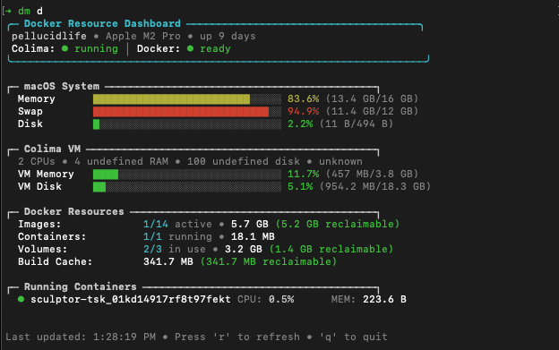
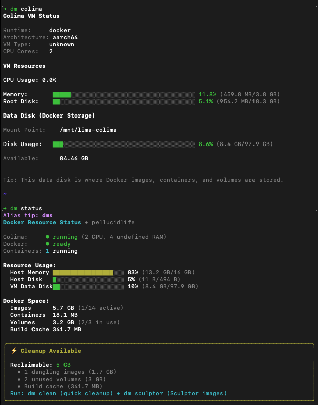

# kilo-dashboard
**Version**: 0.0.1 • **Last Update**: 2025-12-21


━━━━━━━━━━━━━━━━━━━━━━━━━━━

**Layered visibility into macOS → Colima VM → Docker resource hierarchy**

Built with [Ink](https://github.com/vadimdemedes/ink) — the same React-for-CLI framework that powers Claude Code.

### Dashboard View (`dm dashboard`)


### Colima VM Metrics (`dm colima`)


━━━━━━━━━━━━━━━━━━━━━━━━━━━

## Installation

```bash
./install.sh
```

Add to `.zshrc`:

```bash
export DM_BIN="$HOME/Dev/utils/kilo-dashboard/bin/dm.js"
source "$HOME/Dev/utils/kilo-dashboard/dm.zsh"
```

## Usage

```bash
dm              # Quick status (default)
dm dashboard    # Interactive dashboard with auto-refresh
dm clean        # Cleanup wizard
dm containers   # Container details
dm colima       # Colima VM metrics and disk usage
dm sculptor     # Analyze and clean Sculptor snapshot images
```

**Aliases**: `dms` `dmd` `dmc`

### New in v0.0.1

**Disk Space Crisis Prevention:**
- `dm colima` — Monitor Colima VM data disk where Docker images actually live
- `dm sculptor` — Analyze and clean old Sculptor snapshot images by age
- Proactive 80% disk warning prevents space exhaustion
- Status view now shows VM data disk (`/mnt/lima-colima`) alongside host metrics

**Example:**
```bash
# Analyze Sculptor images
dm sculptor

# Clean images older than 30 days
dm sculptor --clean --older-than 30
```

## Why

### Layered Visibility

Shows the resource flow from **macOS → Colima VM → Docker daemon**, with proper distinction between host and VM resources.

**Status View** (`dm status`):
- Host Memory & Disk
- **VM Data Disk** — where Docker images actually live (`/mnt/lima-colima`)
- Docker Space breakdown (images, containers, volumes, cache)
- **⚠️ Warnings** when VM disk reaches 80% capacity

**Colima View** (`dm colima`):
- VM CPU usage
- VM memory allocation and usage
- VM root disk
- **VM data disk** — the critical disk where Docker stores everything

**Sculptor View** (`dm sculptor`):
- Lists Sculptor snapshot images by age
- Shows reclaimable space from old images
- Cleanup recommendations with `--clean` option

### Actionable Output

Instead of raw numbers, it shows **"63GB reclaimable"** and offers `dm clean` to reclaim it.

### Proper Component Architecture

Built with Ink (React for CLI), not string concatenation. Same framework Claude Code uses for its terminal UI.

### Pure zsh Fallback

If Node isn't available, core `status` and `clean` commands still work via `dm.zsh`.

## Requirements

- macOS (Apple Silicon or Intel)
- Node.js 18+
- pnpm 9+
- Colima
- zsh

## Tech Stack

- **Ink** — React for CLI
- **TypeScript** — Type safety
- **Commander** — CLI parsing
- **zsh** — Shell integration & fallback

## Structure

```
kilo-dashboard/
├── src/
│   ├── components/
│   │   ├── Dashboard.tsx       # Main dashboard
│   │   ├── StatusView.tsx      # Quick status with VM disk
│   │   ├── CleanupView.tsx     # Cleanup wizard
│   │   ├── ContainersView.tsx  # Container details
│   │   ├── ColimaView.tsx      # Colima VM metrics (new in v0.0.1)
│   │   ├── SculptorView.tsx    # Sculptor image analysis (new in v0.0.1)
│   │   ├── Header.tsx          # Dashboard header
│   │   └── ResourceBar.tsx     # Progress bars
│   ├── utils/
│   │   ├── colima.ts           # Colima VM stats + data disk
│   │   ├── docker.ts           # Docker API + Sculptor images
│   │   ├── system.ts           # macOS system stats
│   │   └── exec.ts             # Command execution
│   └── dm.tsx                  # CLI entry point
├── design/
│   └── bug-squash.md           # Disk space crisis documentation
├── assets/
│   └── dashboard-screenshot.png
├── dm.zsh                      # Shell integration
└── install.sh                  # Installer
```

## Development

```bash
pnpm install
pnpm build
pnpm dev        # watch mode
```

## Contributing Upstream

**Note for Contributors**: Before adding major features to kilo-dashboard, consider contributing the macOS → Colima → Docker layering logic to [LazyDocker](https://github.com/jesseduffield/lazydocker) instead.

LazyDocker is:
- **Go-based** — More performant, single-binary distribution
- **Extensible** — Plugin architecture for custom views
- **Actively maintained** — Larger community and contributor base
- **Colima-aware** — Already integrates with Colima CLI

The layered visibility concept (macOS → Colima VM → Docker) would benefit LazyDocker's broader user base rather than remaining in this one-off tool.

### What Could Be Contributed

- Colima VM resource tracking (CPU, memory, disk allocation)
- macOS system resource integration
- Three-tier hierarchy visualization
- Colima-specific optimizations and health checks

kilo-dashboard serves as a proof-of-concept. For production-grade tooling, LazyDocker is likely the better community-oriented option.

## License

MIT © kjon-life
